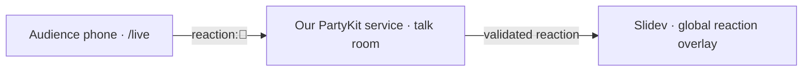

# Live audience reactions for Tester 2.0

Research completed on 17 September 2026. The implementation is now in this repository, with `filiphric.com/live` as the public audience link. See [README.md](/Users/filiphric/tester-2/README.md) for current rehearsal, deployment, and testing instructions. The design and source investigation below record the original plan.

## Recommendation

Add a mobile `/live` page and a persistent reaction overlay to this Slidev deck. Connect both to our own PartyKit service, with a separate room for each talk session. Keep the static presentation on Vercel. This follows the architecture verified in Daniel Roe's public code and fits the existing Vue application without introducing Nuxt.

The presenter can run the deck locally while phones use the public `/live` page: both connect to the same publicly hosted service and room. Both need internet access. A localhost service is useful for development but is not reachable from audience phones over the public internet.

## What Daniel implemented

The repository is [danielroe/roe.dev](https://github.com/danielroe/roe.dev). The following references are pinned to the inspected commit, `b0c6ea906bd042d1d58082c9c42c5e8a1d0899f5`.

| Source | Verified behavior |
| --- | --- |
| [app/pages/live.vue](https://github.com/danielroe/roe.dev/blob/b0c6ea906bd042d1d58082c9c42c5e8a1d0899f5/app/pages/live.vue) | Vue emoji grid with 11 presets, custom emoji input, connection indicator, and immediate local feedback. Uses `partysocket`, host `v.danielroe.partykit.dev` in production, and room `reactions`. Sends strings such as `reaction:👏`. Local emoji animations last 2.5 seconds. |
| [partykit/server.ts](https://github.com/danielroe/roe.dev/blob/b0c6ea906bd042d1d58082c9c42c5e8a1d0899f5/partykit/server.ts) | In the reactions room, accepts messages with the `reaction:` prefix, validates the emoji, stores the latest 100 reactions, and broadcasts the message to all connected clients. It also handles unrelated voting, feedback, and live status features. |
| [shared/utils/emoji.ts](https://github.com/danielroe/roe.dev/blob/b0c6ea906bd042d1d58082c9c42c5e8a1d0899f5/shared/utils/emoji.ts) | Shared Unicode regular expression used for emoji validation. |
| [package.json](https://github.com/danielroe/roe.dev/blob/b0c6ea906bd042d1d58082c9c42c5e8a1d0899f5/package.json) | Separate `partykit:dev` and `partykit:deploy` scripts alongside the Nuxt scripts. |

His audience page animates the sender's own taps locally; it does not register a reaction message listener to display everyone else's reactions. His server does broadcast reactions, including back to the sender. The server stores recent reactions but does not send that history when a client joins, so storage is not necessary for this live-only feature.

His [slides module](https://github.com/danielroe/roe.dev/blob/b0c6ea906bd042d1d58082c9c42c5e8a1d0899f5/modules/slides.ts) references a separate `danielroe/slides` repository. The public GitHub repository API returned 404 for it. I could verify the sender and broadcast server, but not his presentation-side receiver. The overlay below is our proposed implementation, not a claim about his private source.

The [code license is MIT](https://github.com/danielroe/roe.dev/blob/b0c6ea906bd042d1d58082c9c42c5e8a1d0899f5/LICENCE). Preserve its notice if adapting substantial source code.

## Integration into this repository

The installed Slidev version is 52.16.0. It already exposes the route setup API. The deck uses Vue, a local theme, and `slidev build`; there is no application backend. The existing [Vercel configuration](/Users/filiphric/tester-2/vercel.json:1) rewrites paths to `index.html`, which is suitable for directly opening a new client route.

Planned files, relative to the repository root:

| File | Responsibility |
| --- | --- |
| `setup/routes.ts` | Register `/live` with `defineRoutesSetup`, preserving Slidev's built-in routes. Lazy-load the audience page. |
| `pages/live.vue` | Phone-friendly reaction buttons, connection state, local tap feedback, and session selection from the URL. Match the theme's paper, ink, yellow, and monospace styling. |
| `composables/useReactions.ts` | Own the PartySocket lifecycle, parse messages, track connection state, and close connections on unmount. Accept host and room explicitly. |
| `components/ReactionOverlay.vue` | Render a bounded list of floating emojis, remove finished animations, and honor reduced motion. Use `pointer-events: none` so slide navigation remains usable. |
| `global-top.vue` | Mount one persistent overlay for the slideshow. Do not connect in print/export/overview routes; decide explicitly whether to show reactions in presenter view. |
| `custom-nav-controls.vue` | Provide an accessible reaction visibility toggle. Sync the choice between presenter and projected views on the same origin, so muting presenter view also mutes the projector. |
| `components/LiveJoin.vue` | Display the public audience URL and QR code on an opening or dedicated join slide. |
| `shared/reactions.ts` | Share the allowed emoji list and protocol validation between the frontend and server. |
| `partykit/server.ts` and `partykit.json` | Implement room-scoped validation and broadcasting; configure the independently deployed service. |
| `.env.example`, `package.json`, `README.md` | Document public host/default room/join URL configuration and local development/deployment commands. |

Slidev documents both [custom routes](https://sli.dev/custom/config-routes) and [global layers](https://sli.dev/features/global-layers). A global layer persists across slide changes; placing the socket component in individual slide layouts would create unnecessary repeated instances.

Proposed public configuration: `VITE_REACTIONS_HOST`, `VITE_REACTIONS_ROOM`, and `VITE_REACTIONS_JOIN_URL`. Use a session URL such as `/live?room=tester-2-starwest-2026`; ensure the projected deck selects the same room. The QR code must point at the public audience URL even when presenting from localhost. These values are public configuration; deployment credentials must stay out of `VITE_*` variables.

## Behavior for the first version

1. Start with six preset reactions: 👍 ❤️ 😂 👏 🔥 🤯. Validate against the same allowlist on the server; add custom emoji support separately if wanted.
2. Keep a simple `reaction:<emoji>` protocol. The server accepts only valid, small messages and broadcasts only within the selected room.
3. Give each talk session its own room. Room names isolate events; they are not authentication credentials.
4. Show local tap feedback immediately, but have the audience page ignore echoed reaction broadcasts to avoid displaying its own reaction twice.
5. Use per-connection server rate limiting, initially allowing a short burst and roughly two sustained reactions per second. Also cap room broadcast throughput and visible animations; tune these values in rehearsal for the expected audience size. A starting display cap is 30 concurrent emojis.
6. Float reactions upward near a slide edge and remove them after about 2.5 seconds. Reduced-motion mode should use a brief static indication. Clear timers and animations on unmount.
7. Track open, close, and error states. Disable reaction sending while disconnected and discard offline taps, avoiding a burst of outdated reactions after reconnecting. PartySocket supports automatic reconnection and buffers by default, so configure/guard the sending path deliberately. [PartySocket reference](https://docs.partykit.io/reference/partysocket-api/)
8. Make reactions opt-in for a talk session and keep ordinary deck viewing and exports quiet. A presentation-side mute should affect rendering only; authenticated server controls for closing an entire room can be added later.
9. Keep reactions ephemeral. No reaction history or database is needed for the initial behavior. Do not copy Daniel's unrelated vote reset or status endpoints.

## Hosting

Use our own PartyKit project and domain. Do not connect test clients to Daniel's live service. PartyKit documents [managed deployment](https://docs.partykit.io/guides/deploying-your-partykit-server/) and [deployment into a Cloudflare account](https://docs.partykit.io/guides/deploy-to-cloudflare/). Provisioning the service and configuring its public hostname are the external setup steps needed for an audience-ready version; no deployment was attempted during this research.

Keep `npm run dev` for Slidev and add a separate `reactions:dev` command for the local service, plus `reactions:deploy` for deployment. Add `partysocket` as a frontend dependency and `partykit` for service development/deployment. If the route setup imports `@slidev/types`, declare it directly rather than depending on its transitive installation. A QR component may use a small QR library or a generated asset once the audience URL is known.

Vercel itself is also an option: its current documentation says Functions support WebSockets, with connections pinned to a function instance and limited by its maximum duration. Broadcasting across instances requires shared coordination; its chat example uses Redis. I recommend PartyKit here because it matches the verified reference implementation and supplies the room abstraction directly. This recommendation is not based on the outdated claim that Vercel cannot support WebSockets. [Vercel WebSocket support](https://vercel.com/kb/guide/do-vercel-serverless-functions-support-websocket-connections), [Vercel chat architecture](https://vercel.com/kb/guide/real-time-chat-websockets)

## Verification before presenting

- Run the build and directly load `/live` from the built site, including a page refresh.
- Open the audience page and projected deck in separate browser contexts; confirm one tap produces one projected reaction.
- Confirm a different room does not receive that reaction.
- Navigate between slides and open presenter/overview views; confirm sockets and reactions do not multiply.
- Disconnect/reconnect the service; confirm connection indicators recover and offline reactions are not replayed.
- Exercise invalid payloads and bursts against the local service; confirm validation, rate limits, and display caps hold.
- Confirm mute works on the projected view, controls remain keyboard accessible, and reduced-motion mode works.
- Export the deck and confirm the export opens no reaction connection and contains no transient overlay.
- Rehearse with a phone on mobile data and the presenter on the intended network, using the deployed service and matching room.

The repository already has ongoing slide and theme edits. Implementation should add the reaction files independently and make only the small join-slide/configuration changes needed in the current deck.
