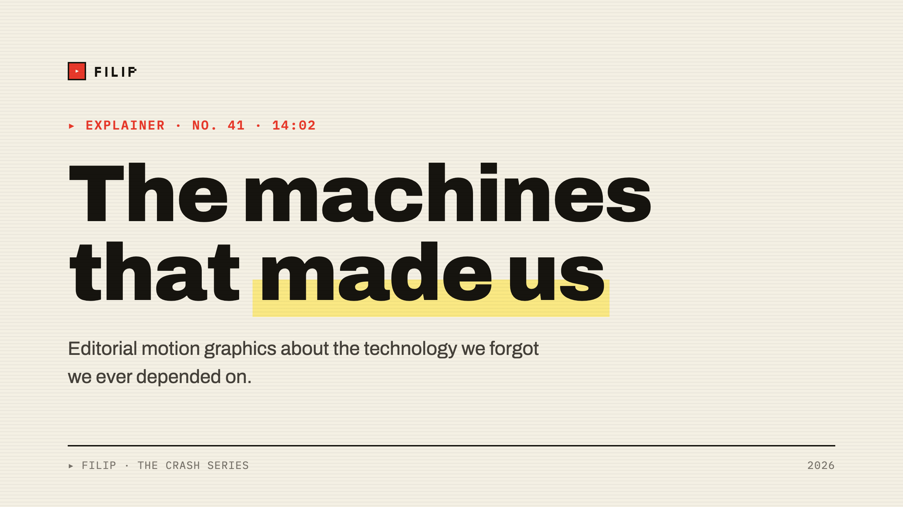
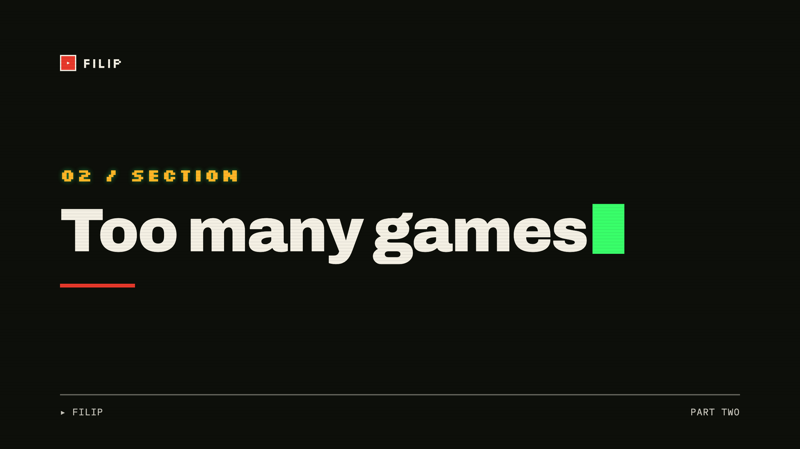
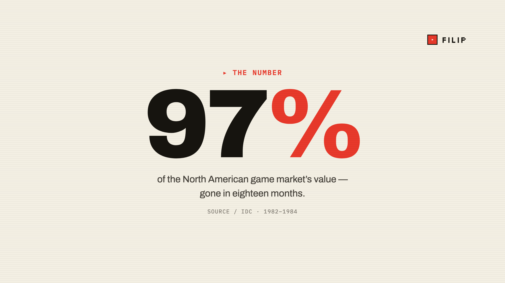
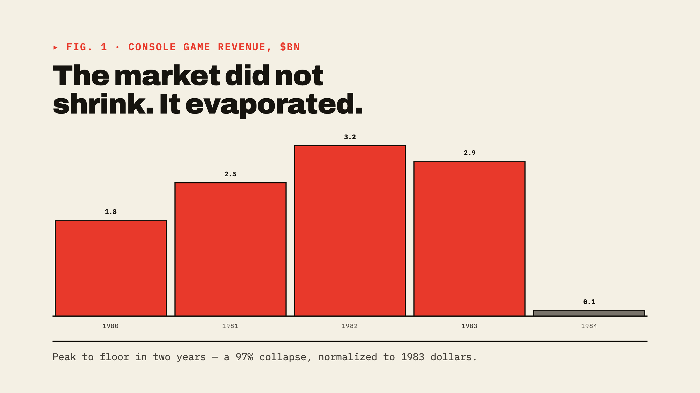

# slidev-theme-filip

A [Slidev](https://sli.dev) theme ported from the **FILIP Editorial-Motion design system** — Vox-style editorial motion graphics meet a retro-computing-museum aesthetic.

> Paper & ink, **one** spot of voltage (highlighter yellow or signal red), flat hard-edged borders, hard offset shadows, and a CRT scanline veil over every slide.



| | |
| --- | --- |
|  |  |
|  | |

## Install

In a Slidev project:

```bash
npm i slidev-theme-filip
```

Then set it in your deck's headmatter:

```yaml
---
theme: filip
---
```

To preview this repo's example deck directly:

```bash
npm install
npm run dev
```

## Design tokens

The full token set from the source system is available as CSS custom properties on every slide — colors (`--paper`, `--ink`, `--signal`, `--highlighter`, `--crt-green`, …), type (`--font-display`, `--font-mono`, `--font-pixel`, `--font-terminal`), spacing (`--sp-1`…`--sp-10`), effects (`--shadow-1/2/3`, `--scanline`, `--dither-2`), and motion. Fonts (Archivo, IBM Plex Mono, Silkscreen, VT323) load from Google Fonts.

The deck renders at a **1280×720** canvas so the editorial type scale maps 1:1.

## Layouts

| layout | purpose |
| --- | --- |
| `cover` | Presentation cover: brand mark, oversized highlighter title, byline |
| `intro` | Editorial intro: kicker, title, description, mono meta row |
| `default` | Standard content: kicker, title + signal rule, body + bullets |
| `section` | Chapter divider on dark CRT: pixel number, title, signal rule |
| `statement` | One bold full-bleed statement on ink |
| `quote` | Large pull quote with signal quotation mark + attribution |
| `fact` | One oversized number, caption + mono source |
| `chart` | Animated bar-chart reveal with an editorial takeaway |
| `two-cols` | Two equal content columns (`::right::` slot) |
| `two-cols-header` | Full-width header over two columns (`::left::` / `::right::`) |
| `image` | Full-bleed image background with content overlay + scrim |
| `image-left` / `image-right` | Full-height image on one side, content on the other |
| `iframe` | Full-frame embedded page with window chrome |
| `iframe-left` / `iframe-right` | Embedded page beside a content column |
| `full` | Edge-to-edge canvas over a grid ground |
| `center` | Vertically + horizontally centered single thought |
| `end` | Closing slide on dark CRT: mark, sign-off, subscribe line |
| `none` | Blank canvas, no chrome |

## Authoring conventions

Write plain Markdown — the theme styles it to brand:

- `#` headings become the editorial display type (sized per layout).
- Paragraphs become the `dek` (24px editorial body).
- Lists get the `▸` signal bullet.
- Wrap a phrase in `<span class="ds-mark">…</span>` for the static **highlighter** sweep, or use the animated `<Highlighter>…</Highlighter>` component.
- The blinking CRT cursor: `<span class="cursor" style="color:var(--crt-green)"></span>`.

### Common frontmatter

```yaml
---
layout: default
kicker: ▸ Source / IDC, 1984     # mono kicker above the title
footerLeft: ▸ FILIP · Atari      # left footer label
footerRight: No. 41 / 07         # right footer label
mark: tr                         # brand mark: tl | tr | none
brand: FILIP                     # wordmark text
---
```

Layout-specific frontmatter: `fact` → `value` / `unit` / `source`; `chart` → `data` / `unit` / `take`; `quote` → `author`; `intro` → `meta`; image layouts → `image` / `caption` / `placeholder`; iframe layouts → `url`.

## Motion — Vox-style animation

The signature Vox feel is **"12fps"**: motion rendered at a low frame rate so it *jolts* instead of glides. The theme gets that in pure CSS via `steps()` easing, and collapses to an instant cut under `prefers-reduced-motion`.

### Slide transitions

Set globally (the theme default is `vox`) or per slide via `transition:` frontmatter:

| transition | feel |
| --- | --- |
| `vox` | **default** — 12fps stepped fade + pop, direction-agnostic |
| `vox-left \| vox-right` | directional 12fps slide (use the pair, e.g. `transition: vox-left \| vox-right`) |
| `vox-cut` | tracking-camera blur cut — content blends through focus |

```yaml
---
layout: section
transition: vox-left | vox-right
---
```

### Highlighter sweep

The marker sweeps across a phrase, Vox-style. By default it fires when you arrive at the slide; pass `:at` to sync it to a click step, or `stepped` for a chunky 12fps stroke:

```md
Lost <Highlighter>97% of its value</Highlighter> in eighteen months.

Lost <Highlighter :at="1">97% of its value</Highlighter> — sweeps on first click.

<Highlighter stepped>frame-by-frame marker</Highlighter>
```

For a static (non-animated) mark, use the `ds-mark` class: `<span class="ds-mark">…</span>`.

### Stepped click reveals

Every `v-click` / `v-clicks` element pops in with the same 12fps stutter instead of a smooth fade — so progressive bullet reveals stay on-brand automatically:

```md
<v-clicks>

- Shovelware flooded the shelves
- Retailers slashed prices to clear stock

</v-clicks>
```

## Components

Registered globally:

- `<Highlighter>text</Highlighter>` — animated marker sweep.
- `<BarChart :data="[{ label, value, color? }]" unit="%" />` — rising-bar reveal.
- `<FilipMark pos="tr" />` — the `▸ FILIP` wordmark.

## Credits

Ported from the *FILIP Editorial-Motion Design System* handoff bundle (claude.ai/design). Fonts via Google Fonts. License: MIT.
